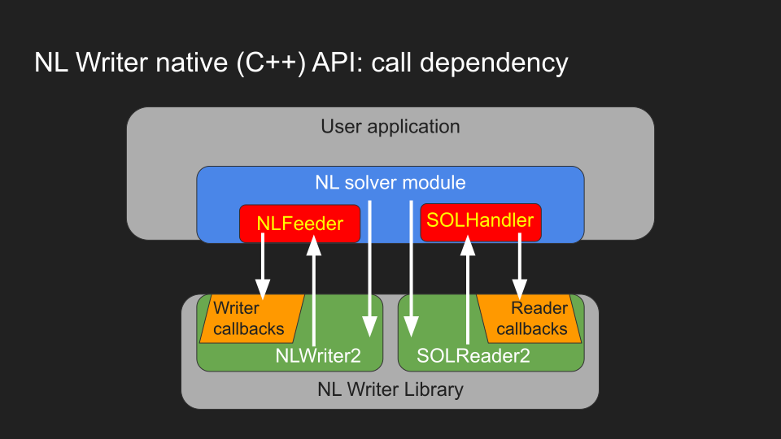

.. _components:

Reusable components and solver driver API
=========================================

This section highlights the major library components,
ranging from basic building blocks necessary for any AMPL driver,
to more advanced utilities. The choice of API for a driver may depend
on :ref:`driver-setups`.

.. _NL-SOL-files:

Reading NL and writing SOL files
-----------------------------------

Any AMPL solver driver currenlty needs to input
an NL file and report results in a SOL file.
The details are taken care of in the
:ref:`recommended driver setup <driver-recommended-setup>`.
However, a :ref:`minimal driver setup <driver-minimal-setup>` might address the
corresponding APIs directly, as described below.

.. _NL-format:

NL format
~~~~~~~~~~~~~~~~~~~~

`NL <https://en.wikipedia.org/wiki/Nl_(format)>`_ is a technical format
for representing
optimization problems in discrete or continuous variables. The format provides
linear constraints, as well as non-linear expression trees. It is described in
the technical report `Writing .nl Files <https://ampl.github.io/nlwrite.pdf>`_.

The NL format supports a wide range of problem types including but not limited
to the following areas of optimization:

* `Linear programming <https://en.wikipedia.org/wiki/Linear_programming>`_
* `Quadratic programming <https://en.wikipedia.org/wiki/Quadratic_programming>`_
* `Nonlinear programming <https://en.wikipedia.org/wiki/Nonlinear_programming>`_
* `Mixed-integer programming <https://en.wikipedia.org/wiki/Linear_programming#Integer_unknowns>`_
* Mixed-integer quadratic programming with or without convex quadratic constraints
* Mixed-integer nonlinear programming
* `Second-order cone programming <https://en.wikipedia.org/wiki/Second-order_cone_programming>`_
* `Global optimization <https://en.wikipedia.org/wiki/Global_optimization>`_
* `Semidefinite programming <https://en.wikipedia.org/wiki/Semidefinite_programming>`_
  problems with bilinear matrix inequalities
* `Complementarity problems <https://en.wikipedia.org/wiki/Complementarity_theory>`_
  (MPECs) in discrete or continuous variables
* `Constraint programming <https://en.wikipedia.org/wiki/Constraint_programming>`_

NL file reader
~~~~~~~~~~~~~~

MP provides a high-performance nl file reader
which is up to `6x faster
<https://zverovich.net/slides/2015-01-11-ics/socp-reformulation.html#/14>`_
than the one provided by the traditional
`AMPL Solver Library (ASL)
<https://ampl.com/resources/learn-more/hooking-your-solver-to-ampl/>`_.

This section describes the C++ API of an NL reader which is

* Reusable: the reader can be used to process NL files in different ways
  and not limited to a single problem representation
* High performance: fast `mmap <https://en.wikipedia.org/wiki/Mmap>`_-based reader
  with `SAX <https://en.wikipedia.org/wiki/Simple_API_for_XML>`_-like API and no
  dynamic memory allocations in the common case
* Easy to use: clean, modern code base and simple API
* Complete: supports all NL constructs including extensions implemented in
  AMPL Solver Library
* Reliable: extensively and continuously tested on a variety of platforms

Easy-to-use functions
^^^^^^^^^^^^^^^^^^^^^

The ``mp/nl.h`` header only contains declarations of
`mp::ReadNLFile` and `mp::ReadNLString`, and can be used to read the standard optimization problem
object of class `mp::Problem`, for example:

.. code-block:: c++

   #include "mp/nl.h"
   #include "mp/problem.h"

   mp::Problem p;
   ReadNLFile("diet.nl", p);

Full NL-reader API
^^^^^^^^^^^^^^^^^^

If you want to provide a custom NL handler, include ``mp/nl-reader.h`` instead.
Class `mp::NLHandler` can be customized for most efficient translation of NL format into
solver API using the :ref:`ProblemBuilder concept <problem-builders>`.

Note that ``mp/nl.h`` is a much smaller header than ``mp/nl-reader.h`` so prefer
it unless you need access to the full NL reader API, described below.

* `mp::ReadNLFile`, `mp::ReadNLString` read NL model

* `mp::NLHandler`, `mp::NullNLHandler` provide interface for a custom NL handler

* `mp::NLHeader` stores problem information

* `mp::NameProvider` reads variable and constraint names
  (see AMPL options ``auxfiles``, ``(solver)_auxfiles``),
  or provides generic names otherwise

* `mp::ReadError`, `mp::BinaryReadError`

* `mp::arith::Kind`

* `mp::READ_BOUNDS_FIRST` can be passed as a flag to `mp::ReadNLFile`

* `mp::MAX_AMPL_OPTIONS` is the maximum number of options reserved
  for AMPL use in NL and SOL formats

SOL file writer
~~~~~~~~~~~~~~~

Writing solution/results output is easiest as part of the general workflow,
see :ref:`model-manager`.

A standalone .sol file writer could be implemented by parameterizing the
`mp::internal::AppSolutionHandlerImpl` (or `mp::internal::SolutionWriterImpl`)
templates by minimal implementations of the `mp::BasicSolver` and
`mp::ProblemBuilder` interfaces.

.. _write-nl-read-sol:

Writing NL and reading SOL files
------------------------------------

For modeling systems and applications using AMPL solvers,
MP provides a library to write :ref:`NL <nl-format>` and read SOL files.
The library is virtually zero-overhead: it does not store the model,
nor does it require any intermediate objects to represent
model information.

NL Writer design
~~~~~~~~~~~~~~~~~~~~~~~~~~~

The NL writer library provides two approaches:

1. "Straightforward" API via `~mp::NLModel` and
   `~mp::NLSolver`. This is currently limited to
   (MI)LP and (MI)QP models.

2. Full NL API via callbacks into custom
   `NLFeeder`
   and `~mp::SOLHandler` classes,
   optionally via `~mp::NLSolver`.

   This approach
   allows a most efficient conversion of a user model's
   internal representation to NL format by providing
   NL component writer callbacks
   (and solution reader callbacks to receive solutions.)

   In turn, the library is flexible to use because
   various components of the user model are provided
   on the library's request from a user-specialized
   `NLFeeder`
   object (for solution input,
   solution components are received by methods
   of a custom `~mp::SOLHandler` class.)

NL Writer API languages
~~~~~~~~~~~~~~~~~~~~~~~~~~~

See the
`NL Writer example folder <https://github.com/ampl/mp/blob/develop/nl-writer2/examples/>`_
and tests.

- **C++ API** is provided by classes
  `~mp::NLSolver`, `~mp::NLModel`, `NLFeeder`, `~mp::SOLHandler`.

- **C API** is provided by structs
  `~NLW2_NLSolver_C`, `~NLW2_NLModel_C`,
  `~NLW2_NLFeeder_C`, `~NLW2_SOLHandler_C`.

  - Currently only (MI)LP/(MI)QP (via `~NLW2_NLModel_C`)
    or linear models (via `~NLW2_NLFeeder_C`, `~NLW2_SOLHandler_C`)
    are supported.

- **Python API** only supports (MI)LP/(MI)QP (via `nlwpy.NLModel`),
  see
  `NLWPY example <https://github.com/ampl/mp/blob/develop/nl-writer2/nlwpy/test/test_solve.py>`_.

.. _recommended-driver-logic:

Recommended driver logic
---------------------------

Using the :ref:`mp::StdBackend and the derived classes <backend-classes>` is the
recommended approach to building a new solver interface.
They provide a convenient API for common solver driver actions,
options and suffixes.
The high-level application structure is suggested as follows:

- :ref:`backend-app` --> :ref:`Custom Backend <backend-classes>` --> Solver.

In the :ref:`recommended driver setup <driver-recommended-setup>`,
the interaction of the Backend with the solver API is
separated in two channels:
model manipulation is delegated to :ref:`model-manager`.
ModelManager addresses solver API via a separate modeling API wrapper:

- :ref:`Custom Backend <backend-classes>` -->
  :ref:`model-manager` --> ... --> :ref:`flat-model-api` --> Solver.

More details are given in :ref:`mm-and-reformulations`.

Thus, solver API is wrapped by two separate classes specializing in model manipulation
vs. process logic. A reason for this design is maintainability and recompilation speed.
Creating such a driver is
:ref:`described in the HowTo <howto>`.

.. _backend-app:

BackendApp
~~~~~~~~~~

`mp::BackendApp` supports basic application functions, such as screen output
and interrupts handling. It calls a CustomBackend which should implement
the `mp::BasicBackend` interface.

.. _backend-classes:

The Backend classes
~~~~~~~~~~~~~~~~~~~

`mp::StdBackend` and `mp::MIPBackend` implement the `mp::BasicBackend` interface and
standardize some common AMPL app behaviour, such as
solver messages and status reporting,
LP basis statuses, and other suffix I/O.
Their solver-specific subclasses can be customized for a particular solver.
They rely on the :ref:`model-manager` interface
for model and solution I/O.

As an example, if the driver should read and write simplex basis status suffixes,
the derived Backend class can declare

.. code-block:: c++

    ALLOW_STD_FEATURE( BASIS, true )
    SolutionBasis GetBasis() override;
    void SetBasis(SolutionBasis ) override;

and define the `GetBasis`, `SetBasis` methods.
See :ref:`implement-standard-features`
for further details.

.. _solver-classes:

Solver, SolverImpl [deprecated]
~~~~~~~~~~~~~~~~~~~~~~~~~~~~~~~

Classes `mp::SolverApp`, `mp::Solver` and `mp::SolverImpl` enable very basic
standard behaviour (e.g., multiobj, solution output). They are deprecated
in favor of the :ref:`BackendApp/Backend classes <backend-classes>` and
can be discontinued in future.

.. _mm-and-reformulations:

Model/solution I/O and reformulations
-------------------------------------

The tools presented in  this section standardize
model/solution I/O
(currently relying on :ref:`NL file input and SOL file output <NL-SOL-files>`)
and conversion for a particular solver.

Overview
~~~~~~~~~~~~

While the components can be theoretically used in isolation, for example just
the :ref:`model-manager`, in the :ref:`driver-recommended-setup` the model
handling is implemented according to the following scheme:

:ref:`model-manager` -->
  :ref:`Problem builder <problem-builders>` -->
  :ref:`Problem converter / flattener <problem-converters>` -->
  :ref:`Flat Converter <flat-converters>` -->
  :ref:`flat-model-api` -->
  Solver.

To give an example, consider the following model:

.. code-block:: ampl

   var x >=0, <=7;
   var y >=0, <=4, integer;

   s.t. Con01: x + log(y) <= 5;
   s.t. Con02: numberof 2 in (x, y) <= 1;

The nonlinear expressions `log` and `numberof` are received from AMPL
in `expression trees <https://en.wikipedia.org/wiki/Nl_(format)>`_ which are input from
an NL file by a :ref:`problem builder <problem-builders>`. At the next step,
:ref:`problem flattener <problem-converters>` replaces nonlinear expressions
by auxiliary variables:

.. code-block:: ampl

   var t1 = log(y);
   var t2 = numberof 2 in (x, y);

   s.t. Con01_: x + t1 <= 5;
   s.t. Con02_: t2 <= 1;

Then,  the defining constraints of ``t1`` and ``t2`` are either passed to the solver
which accepts them via the :ref:`model API <flat-model-api>`, or become reformulated
into more simple entities by :ref:`Flat Converter <flat-converters>`. If the solver
natively accepts a nonlinear constraint, it is possible to still apply automatic
reformulation via a solver option, for example *acc:log* for logarithm. Run the driver
with *-=* or *-c* for a list of natively accepted constraints and options.

An in-depth treatment of some automatic reformulations is given in
[CLModernArch]_, [SOCTransform]_, [MOI]_, and [CP2MIP]_. Customization for a new solver
driver is sketched in :ref:`configure-automatic-model-conversions`.

.. [CP2MIP] G. Belov, P. J. Stuckey, G. Tack, M. Wallace. Improved Linearization
   of Constraint Programming Models. In: Rueher, M. (eds) Principles and Practice of
   Constraint Programming. CP 2016. LNCS, vol 9892.
   Springer, Cham. *https://doi.org/10.1007/978-3-319-44953-1_4*.

.. [CLModernArch] J. J. Dekker. A Modern Architecture for Constraint Modelling Languages.
   PhD thesis. Monash University, 2021.

.. [SOCTransform] R. Fourer and J. Erickson. Detection and Transformation of Second-Order Cone
   Programming Problems in a General-Purpose Algebraic Modeling Language.
   Optimization Online, 2019.

.. [MOI] B. Legat, O. Dowson, J. D. Garcia, M. Lubin.
   MathOptInterface: A Data Structure for Mathematical Optimization Problems.
   INFORMS Journal on Computing 34 (2), 2021.
   *https://doi.org/10.1287/ijoc.2021.1067*.

.. _model-manager:

Model manager
~~~~~~~~~~~~~

Class `mp::BasicModelManager` standardizes the interface for
model input and results output. This interface is used by the
:ref:`Backend classes <backend-classes>`.

* Current suggested implementations rely on `mp::ModelManagerWithProblemBuilder`
  which uses :ref:`NL file input and SOL file output <NL-SOL-files>` as well as
  a model converter. The model converter should implement the `mp::BasicConverter`
  interface and provide a :ref:`Problem Builder <problem-builders>`.

.. _problem-builders:

Problem builders
~~~~~~~~~~~~~~~~

Basic :ref:`Model/solution I/O <NL-SOL-files>` and
:ref:`model managers <model-manager>` rely on a `mp::ProblemBuilder` concept.

* A custom builder can pass the NL model directly into the solver. A few examples are in
  `nl-example.cc <https://github.com/ampl/mp/blob/develop/src/nl-example.cc>`_, `mp::Problem`,
  `SCIP 8.0 NL file reader <https://scipopt.org/>`_.

* Alternatively, standard classes `mp::Problem` and `mp::ColProblem` provide intermediate
  storage for a problem instance. From `mp::Problem`,
  :ref:`conversion tools <problem-converters>`
  can be customized to reformulate the instance for a particular solver.

.. _problem-converters:

`mp::Problem` converters
~~~~~~~~~~~~~~~~~~~~~~~~

Given a problem instance in the standard format `mp::Problem`, several
tools can be adapted to convert the instance for a particular solver.

* For :ref:`'flat' (expression-less) solvers <flat-solvers>`,
  `mp::ProblemFlattener` can walk the NL forest, passing flattened expressions as
  constraints to :ref:`flat-converters`. In turn, these
  facilitate conversion of flat constraints which are not natively accepted by a
  solver into simpler forms.

* For :ref:`expression-tree supporting solvers <expression-solvers>`,
  `mp::ExprVisitor` and `mp::ExprConverter` are efficient type-safe templates
  which can be customized to transform instances for a particular expression-based
  solver API.

.. _flat-converters:

Flat model converters
~~~~~~~~~~~~~~~~~~~~~

`mp::FlatConverter` and `mp::MIPFlatConverter` represent and
convert flat models (i.e., models :ref:`without expression trees <flat-solvers>`).
Typically, a flat model
is produced from an NL model by :ref:`Problem Flattener <problem-converters>`.
As a next step, constraints which are not natively accepted by a
solver, are transformed into simpler forms. This behavior
can be flexibly parameterized for a particular solver, preferably
via the solver's modeling API wrapper:

* :ref:`flat-model-api` is the interface via which `mp::FlatConverter` addresses
  the underlying solver.

* :ref:`value-presolver` transforms solutions and suffixes between the
  original NL model and the flat model.

* :ref:`conversion-graph` discusses exporting of the flattening / reformulation graph.

.. _flat-model-api:

Flat model API
~~~~~~~~~~~~~~

`mp::BasicFlatModelAPI` is the interface via which :ref:`flat-converters` address
the underlying solver.

Constraint acceptance
^^^^^^^^^^^^^^^^^^^^^

A subclassed wrapper, such as `mp::GurobiModelAPI`,
signals its accepted constraints and which model reformulations are preferable.
For example, `GurobiModelAPI` declares the following in order to natively
receive the logical OR constraint:

.. code-block:: c++

      ACCEPT_CONSTRAINT(OrConstraint,
        Recommended,                       // Driver recommends native form
        CG_General)                        // Constraint group for suffix exchange
      void AddConstraint(const OrConstraint& );

By default, if the driver does not mark a constraint as acceptable,
`mp::FlatConverter` and its descendants attempt to simplify it. See
:ref:`configure-automatic-model-conversions` for further details.

Model query API
^^^^^^^^^^^^^^^^^^^^^^^^^^^^^^^

To obtain a summary information on the flat model, for example the number
of constraints of a particular type or group, use the helper object of type
`mp::FlatModelInfo` obtainable by `mp::BasicFlatModelAPI::GetFlatModelInfo`.

To preallocate memory for a class of constraints, the implementation can
redefine method `mp::BasicFlatModelAPI::InitProblemModificationPhase`:

.. code-block:: c++

    void MosekModelAPI::InitProblemModificationPhase(const FlatModelInfo* info) {
      /// Preallocate linear and quadratic constraints.
      /// CG_Linear, CG_Quadratic, etc. are the constraint group indexes
      /// provided in ACCEPT_CONSTRAINT macros.
      MOSEK_CCALL(MSK_appendcons(lp(),
                             info->GetNumberOfConstraintsOfGroup(CG_Linear) +
                             info->GetNumberOfConstraintsOfGroup(CG_Quadratic)));
    }

.. _value-presolver:

Value presolver
~~~~~~~~~~~~~~~

Class `mp::pre::ValuePresolver` manages transformations of solutions and suffixes
between the original NL model and the converted model. For driver architectures
with :ref:`model-manager`, the value presolver object must be shared between
the model converter and the :ref:`Backend <backend-classes>` to enable
solution/suffix transformations corresponding to those on the model, see
`mp::CreateGurobiModelMgr` as an example.

Invocation API
^^^^^^^^^^^^^^

To use the ValuePresolver API, the following classes are needed:

- `mp::pre::BasicValuePresolver` defines an interface for `mp::pre::ValuePresolver`.

- `mp::pre::ValueNode` temporarily stores values corresponding to a single type of
  model item (variables, constraints, objectives).

- `mp::pre::ValueMap` is a map of node values, where the key usually corresponds to
  an item subcategory. For example, Gurobi distinguishes attributes for the
  following constraint categories: linear, quadratic, SOS, general. Thus, the
  reformulation graph needs to have these four types of target nodes for constraint
  values:

  .. code-block:: c++

    pre::ValueMapInt GurobiBackend::ConsIIS() {
      ......
      return {{{ CG_Linear, iis_lincon },
        { CG_Quadratic, iis_qc },
        { CG_SOS, iis_soscon },
        { CG_General, iis_gencon }}};
    }

- `mp::pre::ModelValues` is a class joining value maps for variables, constraints,
  and objectives. It is useful when the conversions connect items of different types:
  for example, when converting an algebraic range constraint to an equality
  constraint with a bounded slack variable, the constraint's basis status is mapped
  to that of the slack. Similarly, the range constraint should be reported infeasible
  if either the slack's bounds or the equality are:

  .. code-block:: c++

    IIS GurobiBackend::GetIIS() {
      pre::ModelValuesInt mv = GetValuePresolver().
        PostsolveIIS( pre::ModelValuesInt{ VarsIIS(), ConsIIS() } );
      return { mv.GetVarValues()(), mv.GetConValues()() };
    }

Implementation API
^^^^^^^^^^^^^^^^^^

To implement value pre- / postsolving, the following API is used:

- `mp::pre::ValuePresolver` implements the interface of
  `mp::pre::BasicValuePresolver`. It calls the individual pre- and postsolve
  routines.

- `mp::pre::BasicLink` is the interface to various implementations of links
  between nodes, such as
  `mp::pre::CopyLink`, `mp::pre::One2ManyLink`, and
  `mp::pre::RangeCon2Slack`.

- Expression tree flattenings into new constraints and variables,
  as well as subsequent conversions,
  are by default automatically linked by `mp::pre::One2ManyLink`.
  To implement a specific link, see the example of `mp::pre::RangeCon2Slack`.
  In particular, autolinking should normally be turned off.

.. _conversion-graph:

Reformulation graph
~~~~~~~~~~~~~~~~~~~

Explore the flattening and reformulation graph for your model,
as described in :ref:`reformulation-graph`.

C++ ASL adapter
---------------

An efficient type-safe `C++ adapter for the traditional ASL library
<https://github.com/ampl/mp/tree/develop/src/asl>`_ for
connecting solvers to AMPL and other systems. ASL has many additional functions,
such as writing NL files and automatic differentiation.

More details
------------

This section overviews some more details of the API.

For a complete API reference, see the :ref:`index <genindex>`.

Problem representation
~~~~~~~~~~~~~~~~~~~~~~

A standard representation of a model, convenient for intermediate storage.

* `mp::ProblemInfo`, `mp::var::Type`, `mp::obj::Type`, `mp::func::Type`, `mp::ComplInfo`

Expression forest walkers
~~~~~~~~~~~~~~~~~~~~~~~~~

Typesafe expression walkers for models stored in memory.

* `mp::expr::Kind`, `mp::expr::str`, `mp::expr::nl_opcode`

* `mp::BasicExprVisitor`, `mp::ExprVisitor`, `mp::ExprConverter`

* `mp::ProblemFlattener`

Solution status
~~~~~~~~~~~~~~~

* `mp::sol::Status`

Suffixes
~~~~~~~~

* `mp::suf::Kind`, `mp::SuffixDef`

* Standard suffix value enums: `mp::IISStatus`, `mp::BasicStatus`

