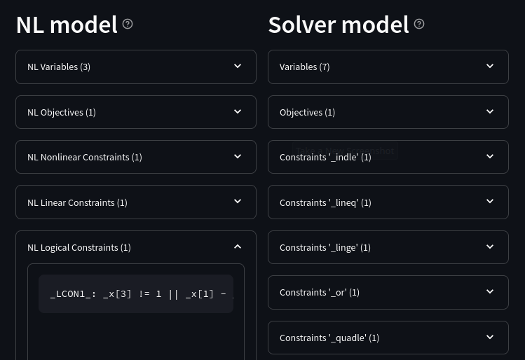

.. _modeling-tools:

Tools & details
---------------------------

This section highlight some tools aiding modeling and solving.

.. _supported-constraints:

Supported constraints
***********************************

To find out which constraints are natively supported by the solver,
or, more generally, understood by MP,
there are two ways.

Method 1: acceptance options
^^^^^^^^^^^^^^^^^^^^^^^^^^^^^^^^^^^

List the solver's natively supported constraints,
by running the solver executable with the ``-=acc`` command-line switch
which lists all solver options starting with the ``acc:`` prefix:

.. code-block:: bash

  gurobi -=acc

Alternatively, the full option list for each solver is published
at `AMPL Development <https://dev.ampl.com/solvers/index.html>`_.

.. _full-cons-list:

Method 2: full constraint list
^^^^^^^^^^^^^^^^^^^^^^^^^^^^^^^^^^^^^^^^^^

List all constraints known by the MP model converter, including some
internal ones, by running the solver executable with the ``-c``
command-line switch. Here is a beautified summary of the resulting
(rather technical) output for a generic solver:

.. csv-table::
   :file: tables/constr_list.csv
   :widths: 5, 25, 70
   :header-rows: 1

.. _explore-reformulations:

Explore the reformulations
*************************************

To explore the reformulations performed on your model, there are
the following ways.

.. _explore-final-model:

Export the solver model
^^^^^^^^^^^^^^^^^^^^^^^^^^^^^^^^^^^^^^

To explore the model received by the solver,
export the model
in one of the solver's general formats:

.. code-block:: ampl

  ampl: option mosek_auxfiles rc;   ## To use var/con names
  ampl: option mosek_options 'writeprob=/tmp/ell.jtask'; solve;

Some solvers can export their presolved model:

.. code-block:: ampl

  option gurobi_options 'outlev=1 writepresolved=disj_pre.lp';

.. _reformulation-graph:

Reformulation explorer
^^^^^^^^^^^^^^^^^^^^^^^^^^^^^^^^^^

MP provides a tool to explore and compare the model
provided to an MP solver driver in the NL file, and the final model
sent to the underlying solver.

Tool invocation
~~~~~~~~~~~~~~~~~~~~~~~~~~

To use the reformulation explorer online, go to http://ampl.com/streamlit.

To run locally, download the `MP repository <https://github.com/ampl/mp>`_.
In subfolder `support/modelexplore`, run the command::

  streamlit run modelexplore.py

Using the explorer
~~~~~~~~~~~~~~~~~~~~~~~~~~~~

To produce the input data for the tool, containing the reformulations,
run an MP solver with the `writegraph` option, as follows.

.. tabs::

   .. tab:: AMPL

        .. code-block:: ampl

            ampl: option solver gurobi;           # select solver
            ampl: option gurobi_auxfiles rc;      # write var/con names
            ampl: option gurobi_options 'writegraph=model.jsonl lim:time=0';
            ampl: solve;                          # solve the problem

   .. tab:: Python

        How to install using `amplpy <https://amplpy.ampl.com>`_:

        .. code-block:: bash

            # Install Python API for AMPL:
            $ python -m pip install amplpy --upgrade

            # Install AMPL & solver modules:
            $ python -m amplpy.modules install gurobi # install Gurobi

            # Activate your license (e.g., free ampl.com/ce or ampl.com/courses licenses):
            $ python -m amplpy.modules activate <your-license-uuid>

        How to use:

        .. code-block:: python

            from amplpy import AMPL
            ampl = AMPL()
            ...
            ampl.set_option("gurobi_auxfiles", "rc")
            ampl.solve(solver="gurobi", gurobi_options="writegraph=graph.jsonl")

        Learn more about what we have to offer to implement and deploy `Optimization in Python <https://ampl.com/python/>`_.

   .. tab:: Other APIs

       `AMPL APIs <https://ampl.com/apis/>`_ are interfaces
       that allow developers to access the features of the AMPL interpreter
       from within a programming language. We have APIs available for:

       - `Python <https://ampl.com/api/latest/python>`_
       - `R <https://ampl.com/api/latest/R>`_
       - `C++ <https://ampl.com/api/latest/cpp>`_
       - `C#/.NET <https://ampl.com/api/latest/dotnet>`_
       - `Java <https://ampl.com/api/latest/java>`_
       - `MATLAB <https://ampl.com/api/latest/matlab>`_

   .. tab:: Command line

       .. code-block:: bash

           auxfiles=rc ampl -obmodel model.mod data.dat
           gurobi model.nl writegraph=reformulations.jsonl lim:time=0

In the Explorer, upload the JSONL file. The NL (source) and solver's
(destination) models are displayed.

.. note::
   The NL model displayed in most cases coincides
   with the output of AMPL's `solexpand` command.

   The solver model is equivalent to the solver's exported model
   via the `tech:writeprob` option.

The following operations are possible:

- *Search for a text pattern*. To display the subsets of the models
  containing a certain name, enter that in the 'Search pattern' field.

- *Download (subsets of) the models*. To download currently
  displayed (sub)models, use the download buttons.

Example
~~~~~~~~~~~~~~~~~~~~~

Consider the following AMPL model.

.. code-block:: ampl

   var x binary;
   var y binary;
   var z binary;
   minimize TotalSum: z + 1;
   subj to C1: x+y >= 1;
   subj to C2: x^2+y^2+(z-0.7)^2 <= 1.83;
   subj to C3: z==1 ==> x-y <= 2;

To see the reformulations applied to constraint `C3`,
download the corresponding JSONL file in the Explorer
and enter `C3` in the 'Search pattern' field. For Gurobi,
the resulting subset of the Solver model can be as follows:

.. code-block:: ampl

   ##  Variables (3)
   var C3 binary;
   var C3_3_ binary;
   var C3_5_ = 1;

   ##  Constraints '_indle' (1)
   C3_4_: C3_3_==1 ==> (1*x - 1*y <= 2);

   ##  Constraints '_lineq' (1)
   C3_2_: 1*z - 1*C3 == -1;

   ##  Constraints '_or' (1)
   C3_6_: C3_5_ == OrConstraint([C3, C3_3_], []);

The constraint types (`_indle`, `_or`, etc.) are as explained
in :ref:`supported-constraints`.

.. _solution-check:

Automatic solution check
******************************

Solutions obtained from the solver are automatically checked
for correctness with given tolerances
(see :ref:`solver-options` ``sol:chk:...``.)

There are two checking modes: "realistic" and "idealistic".
For linear and quadratic models they are equivalent.
Differences can arise for models with other non-linear expressions.

In "realistic" mode, any expressions computed by the solver
and reported via an auxiliary variable, are trusted with
a tolerance. In "idealistic" mode, all expression trees
are recomputed.

Motivation
^^^^^^^^^^^^^^^^^^^^^^^^^^^^^

Consider the disjunction constraint

.. code-block:: ampl

    C: y<=6 or z>=10;

With ``y=6.0000000001`` and ``z=9.9999999999``, and assuming the solver's
feasibility tolerance is at a typical value (such as :math:`10^{-6}`),
most Mathematical Programming solvers consider the disjunction satisfied.
And, from a practical viewpoint, it is (given finite-precision
computations).

Our "realistic" checking mode does exactly this: it trusts the solver results
up to a tolerance.

In contrast, AMPL reports the constraint violated:

.. code-block:: ampl

    ampl: let y:=6.0000000001;
    ampl: let z:=9.9999999999;
    ampl: display C.val;
    C.val = 0

That is, when expressions ``y<=6`` and ``z>=10`` are re-evaluated
and their results substituted into ``C``, ``C`` holds false.

The role of the "idealistic" checking mode is to warn the user about the fact,
that even if the solver has a correct solution up to its tolerances
(which is examined by the "realistic" mode),
it can be wrong for a tolerance-unaware checker.

By default, "idealistic" check is performed for objective values only,
see example below. To enable it for constraints, use
:ref:`option <solver-options>` ``chk:mode``.

Warnings format
^^^^^^^^^^^^^^^^^^^^^^^^^^

Example
~~~~~~~~~~~~~~~~~~~~~~

To explain the solution check warning format, let's solve a relaxed version
of the following model:

.. code-block:: ampl

    var x integer <= 0;
    var y integer;
    minimize TotalSum: x - 2*y;
    subject to C1: -x + 21*y >= 2;
    subject to C2: -3*x + 2*y <= 1;
    subject to C3: 20*x + y <= 200;

Running Gurobi with option ``feasrelax 1``, we trick MP
(it does not know the effect of ``feasrelax``).

.. code-block:: ampl

    ampl: option solver gurobi;
    ampl: option gurobi_options 'feasrelax 1';
    ampl: option gurobi_auxfiles rc;      ## To pass model names
    ampl: solve;
    Gurobi 10.0.2:   alg:feasrelax = 1
    Gurobi 10.0.2: optimal solution; feasrelax objective 160552
    5 simplex iterations
    1 branching nodes
    absmipgap=2, relmipgap=1.2457e-05
    ------------ WARNINGS ------------
    WARNING:  "Solution Check"
         [ sol:chk:feastol=1e-06, :feastolrel=1e-06, :inttol=1e-05,
           :round='', :prec='' ]
      - 2 original variable(s) violate bounds,
            up to 1E+05 (abs, item 'y'), up to 1E+00 (rel, item 'y')
    Algebraic expression violations:
      - 1 linear constraint(s),
            up to 2E+00 (abs, item 'C1'), up to 1E+00 (rel, item 'C1')
    Objective value violations:
      - 1 objective value(s) violated,
            up to 2E+05 (abs, item 'TotalSum')

    WARNING:  "Solution Check (Idealistic)"
         [ sol:chk:feastol=1e-06, :feastolrel=1e-06, :inttol=1e-05,
           :round='', :prec='' ]
    Objective value violations:
      - 1 objective value(s) violated,
            up to 2E+05 (abs, item 'TotalSum')
    AMPL may evaluate constraints/objectives differently
    than the solver, see mp.ampl.com/solution-check.html.

After the solver log we see 2 warnings. The first is ``Solution Check``.
This reports the "realistic" violations. In square brackets we see
numeric solver options relevant for checking.
Then follows information on variable bound violations.
It includes the number of violations (2), maximal absolute violation
and variable name, as well as maximal relative violation.

Paragraph ``Algebraic expression violations`` presents similar information,
for each expression type (see the :ref:`full list <constr-list>`). Paragraph
``Objective value violations`` does that for objectives.

The 2nd warning is ``Solution Check (Idealistic)``.
As the idealistic check is performed by default for objectives only,
this warning repeats the information about objective value violation.

.. _constr-list:

Expression list
~~~~~~~~~~~~~~~~~~~~~~~~~~~~

The full list of expressions which can be reported is given
in section :ref:`Full constraint list <full-cons-list>`.

"Realistic" solution check
^^^^^^^^^^^^^^^^^^^^^^^^^^^^^^^^^^^^^^

In this mode, variable values are taken as they were reported by the solver
(with possible modifications via options
``sol:chk:round`` and ``sol:chk:prec``.)
This check is enough for most practical situations, and its warnings mean
that the solver's reported solution violates checking tolerances.

.. code-block:: ampl

    ------------ WARNINGS ------------
    WARNING:  "Solution Check"
         [ sol:chk:feastol=1e-06, :feastolrel=1e-06, :inttol=1e-05,
           :round='', :prec='' ]
    Algebraic expression violations:
      - 1 quadratic constraint(s),
          up to 1E+00 (item 'socp[13]')

In this example, realistic check reports a constraint violation
of 1.0, which can mean a significant violation if the constraint's
right-hand side is of moderate magnitude (in this case zero,
that's why the relative violation is missing).

"Idealistic" solution check
^^^^^^^^^^^^^^^^^^^^^^^^^^^^^^^^^^^^^^^^^

In this mode, non-linear expressions are recomputed and compared to solver values.
The recomputation is performed similar to how AMPL does it when asked to
display objective value or constraint body / slack.
Thus, "idealistic" violations mean objective and constraint expressions
reported in AMPL may be different from the solver.
While the most serious type of violations are the "realistic" ones,
the "idealistic" mode warns about (significant) differences when expressions are
recomputed from scratch.
Consider the following example.

.. code-block:: ampl

    var x >=0, <=100;
    maximize Total: if x<=5 and x>=5.00000000001 then 10;

Most solvers apply a constraint feasibility tolerance of the order :math:`10^{-6}`.

.. code-block:: ampl

    ampl: option solver gurobi;
    ampl: solve;
    Gurobi 10.0.2: optimal solution; objective 10
    0 simplex iterations

    ------------ WARNINGS ------------
    WARNING:  "Solution Check (Idealistic)"
         [ sol:chk:feastol=1e-06, :feastolrel=1e-06, :inttol=1e-05,
           :round='', :prec='' ]
    Objective value violations:
      - 1 objective value(s) violated,
            up to 1E+01 (abs)
    AMPL may evaluate constraints/objectives differently
    than the solver, see mp.ampl.com/solution-check.html.

    ampl: display x;
    x = 5

We see that ``x=5`` satisfies the ``if`` with that tolerance.
Thus, our realistic check passes, but the idealistic check complains.
Indeed, if we ask AMPL to recompute the objective value:

.. code-block:: ampl

    ampl: display Total;
    Total = 0

we see that AMPL does it "idealistically"
(it does not know about solver tolerances,
or whether the user has provided variable values manually.)

To see which expressions cause the violation,
use driver option ``chk:mode``:

.. code-block:: ampl

    ampl: option gurobi_options 'chk:mode=1023';
    ampl: solve;
    Gurobi 10.0.2:   sol:chk:mode = 1023
    Gurobi 10.0.2: optimal solution; objective 10
    0 simplex iterations

    ------------ WARNINGS ------------
    WARNING:  "Solution Check (Idealistic)"
         [ sol:chk:feastol=1e-06, :feastolrel=1e-06, :inttol=1e-05,
           :round='', :prec='' ]
    Algebraic expression violations:
      - 1 constraint(s) of type ':ifthen',
            up to 1E+01 (abs)
    Logical expression violations:
      - 1 constraint(s) of type ':and'
    Objective value violations:
      - 1 objective value(s) violated,
            up to 1E+01 (abs)
    AMPL may evaluate constraints/objectives differently
    than the solver, see mp.ampl.com/solution-check.html.

*Hint*: to display AMPL model names,
set ``option (solver_)auxfiles rc;`` as follows:

.. code-block:: ampl

    ampl: option gurobi_auxfiles rc;
    ampl: solve;
    Gurobi 10.0.2:   sol:chk:mode = 1023
    Gurobi 10.0.2: optimal solution; objective 10
    0 simplex iterations

    ------------ WARNINGS ------------
    WARNING:  "Solution Check (Idealistic)"
         [ sol:chk:feastol=1e-06, :feastolrel=1e-06, :inttol=1e-05,
           :round='', :prec='' ]
    Algebraic expression violations:
      - 1 constraint(s) of type ':ifthen',
            up to 1E+01 (abs, item 'Total_11_')
    Logical expression violations:
      - 1 constraint(s) of type ':and',
            (item 'Total_7_')
    Objective value violations:
      - 1 objective value(s) violated,
            up to 1E+01 (abs, item 'Total')
    AMPL may evaluate constraints/objectives differently
    than the solver, see mp.ampl.com/solution-check.html.

Remedies
^^^^^^^^^^^^^^^^^^^^^^^^^^^^^^^^

For "realistic" solution violations, the reason is most probably
:ref:`numerical_accuracy`.

For "idealistic" warnings, to make sure AMPL can access the true
objective value, see a
`Colab example <https://colab.ampl.com/#solution-check-discontinuous-objective-function>`_
detailing
a more common case and a remedy consisting of an explicit
variable for the objective value.
