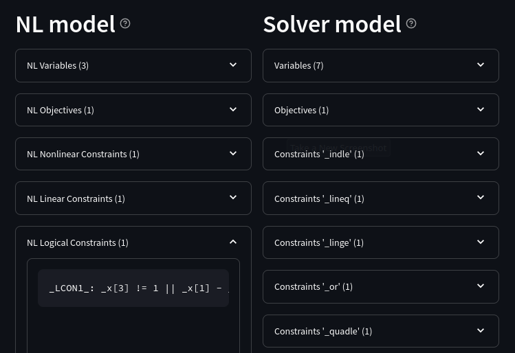
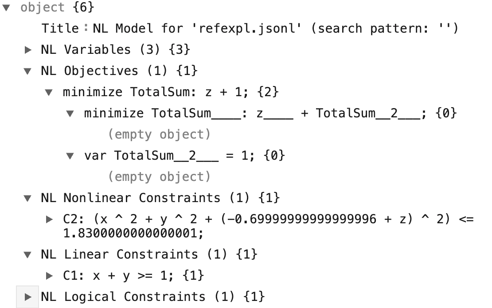

.. _modeling-tools:

Tools & details
---------------------------

This section highlights some tools aiding modeling and solving.

.. _supported-constraints:

Reformulation settings
***************************************************************

This sections gives a technical list of solver-side constraints
and expressions, as well as control options for their
reformulations.

.. _flat-vs-expressions:

Flat constraints vs expression trees
^^^^^^^^^^^^^^^^^^^^^^^^^^^^^^^^^^^^^^^^^^^^^^^^^^^^^^^

Some solvers require each individual expression
to be submitted as a *flat constraint*
with an introduced auxiliary variable for the expression
result:

.. code-block:: ampl

    aux_var = max(x, y);

Same or different solvers allow an alternative way, namely
*expression trees* or *complete formulas*:

.. code-block:: ampl

    s.t. NLConstraint1: 2*x + 4*exp(16 - 2*sin(x + y^2)) <= 19;

In the latter case, expression ``exp(16 - 2*sin(x + y^2))``
is passed to the solver as a single formula using
an expression tree mechanism. This representation allows
more general treatment of nonlinearities in the solver,
usually resulting in better performance and numerical precision.
Examples of MP solvers supporting expression trees are
SCIP 9.1.1 and Gurobi 12.

Next subsection explains how a user can switch between
flat constraints and formulas, if available,
or force reformulation.

Acceptance options
^^^^^^^^^^^^^^^^^^^^^^^^^^^^^^^^^^^

Sometimes it is handy to disable all automatic reformulations,
for example, to test manual modeling of high-level constructs.
For that, declare all contraints as natively accepted by the solver:
set :ref:`MP solver option <solver-options>` ``acc:_all=2``.
Vice versa, to force full linearization, set ``acc:_all=0``.

For individual constraint types, to disable reformulations,
declare them as natively accepted:
e.g., ``acc:alldiff=2``. Or, to apply MP reformulation,
despite the solver natively accepting the construct,
set the option to 0: ``acc:or=0``.
In detail, a constraint's or expression's
individual
acceptance option can have some or all of the following values:

.. code-block:: bash

    acc:sin
      Solver acceptance level for 'SinConstraint' as either constraint or
      expression, default 4:

      0 - Not accepted natively, automatic redefinition will be attempted
      1 - Accepted as constraint but automatic redefinition will be used
          where possible
      2 - Accepted as constraint natively and preferred
      3 - Accepted as expression but automatic redefinition will be used
          where possible
      4 - Accepted as expression natively and preferred

To uniformly control all expressions, use option `acc:_expr`:

.. code-block:: bash

    acc:_expr
      Solver acceptance level for all expressions, default 1:

      0 - Not accepted, all expressions will be treated as flat constraints,
          or redefined
      1 - Accepted. See the individual acc:... options

Value 1 passes expression trees to the solver
(if natively supported; corresponds to value 4 in the individual options),
value 0 uses flat constraints
(again, those which are natively supported;
corresponds to value 2 or 0 in the individual options.)

Finally, some kinds of reformulations which are applied when needed,
along with corresponding configuration settings,
are described in :ref:`expressions_supported`.

To find out which constraints or expressions
are natively supported by the solver,
or, more generally, understood by MP,
and to control which are reformulated,
there are two ways.

Querying acceptance options
^^^^^^^^^^^^^^^^^^^^^^^^^^^^^^^^^^^

List the solver's natively supported constraints and expressions,
by running the solver executable with the ``-=acc`` command-line switch
which lists all solver options starting with the ``acc:`` prefix:

.. code-block:: bash

  gurobi -=acc

Alternatively, the full option list for each solver is published
at `AMPL Development <https://dev.ampl.com/solvers/index.html>`_.

.. _full-cons-list:

Full constraint list
^^^^^^^^^^^^^^^^^^^^^^^^^^^^^^^^^^^^^^^^^^

List all constraints known by the MP model converter, including some
internal ones, by running the solver executable with the ``-c``
command-line switch. Here is a beautified summary of the resulting
(rather technical) output for a generic solver:

.. csv-table::
   :file: tables/constr_list.csv
   :widths: 5, 25, 70
   :header-rows: 1

.. _explore-reformulations:

Explore the reformulations
*************************************

To explore the reformulations performed on your model, there are
the following ways.

.. _explore-final-model:

Export the solver model
^^^^^^^^^^^^^^^^^^^^^^^^^^^^^^^^^^^^^^

To explore the model received by the solver,
export the model
in one of the solver's general formats:

.. code-block:: ampl

  ampl: option mosek_auxfiles rc;   ## To use var/con names
  ampl: option mosek_options 'writeprob=/tmp/ell.jtask'; solve;

Some solvers can export their presolved model:

.. code-block:: ampl

  option gurobi_options 'outlev=1 writepresolved=disj_pre.lp';

.. _reformulation-graph:

Reformulation explorer
^^^^^^^^^^^^^^^^^^^^^^^^^^^^^^^^^^

MP provides a tool to explore and compare the model
provided to an MP solver driver in the NL file, and the final model
sent to the underlying solver. Moreover, intermediate reformulation
steps can be seen in a tree representation.

Tool invocation
~~~~~~~~~~~~~~~~~~~~~~~~~~

To use the reformulation explorer online,
go to `Reformulation Explorer <https://ampl.com/streamlit/Reformulation_Explorer>`_.

To run locally, download the `MP repository <https://github.com/ampl/mp>`_.
In subfolder `support/modelexplore`, run the command::

  streamlit run modelexplore.py --server.maxUploadSize=1024

Using the explorer
~~~~~~~~~~~~~~~~~~~~~~~~~~~~

To produce the input data for the tool, containing the reformulations,
run an MP solver with the `writegraph` option, as follows.

.. tab-set::

   .. tab-item:: AMPL

        .. code-block:: ampl

            ampl: option solver gurobi;           # select solver
            ampl: option gurobi_auxfiles rc;      # write var/con names
            ampl: option gurobi_options 'writegraph=model.jsonl lim:time=0';
            ampl: solve;                          # solve the problem

   .. tab-item:: Python

        How to install using `amplpy <https://amplpy.ampl.com>`_:

        .. code-block:: bash

            # Install Python API for AMPL:
            $ python -m pip install amplpy --upgrade

            # Install AMPL & solver modules:
            $ python -m amplpy.modules install gurobi # install Gurobi

            # Activate your license (e.g., free ampl.com/ce or ampl.com/courses licenses):
            $ python -m amplpy.modules activate <your-license-uuid>

        How to use:

        .. code-block:: python

            from amplpy import AMPL
            ampl = AMPL()
            ...
            ampl.set_option("gurobi_auxfiles", "rc")
            ampl.solve(solver="gurobi", gurobi_options="writegraph=graph.jsonl")

        Learn more about what we have to offer to implement and deploy `Optimization in Python <https://ampl.com/python/>`_.

   .. tab-item:: Other APIs

       `AMPL APIs <https://ampl.com/apis/>`_ are interfaces
       that allow developers to access the features of the AMPL interpreter
       from within a programming language. We have APIs available for:

       - `Python <https://ampl.com/api/latest/python>`_
       - `R <https://ampl.com/api/latest/R>`_
       - `C++ <https://ampl.com/api/latest/cpp>`_
       - `C#/.NET <https://ampl.com/api/latest/dotnet>`_
       - `Java <https://ampl.com/api/latest/java>`_
       - `MATLAB <https://ampl.com/api/latest/matlab>`_

   .. tab-item:: Command line

       .. code-block:: bash

           auxfiles=rc ampl -obmodel model.mod data.dat
           gurobi model.nl writegraph=reformulations.jsonl lim:time=0

In the Explorer, upload the JSONL file. The NL (source) and solver's
(destination) models are displayed.

.. note::
   The NL model displayed in most cases coincides
   with the output of AMPL's `solexpand` command.

   The solver model is equivalent to the solver's exported model
   via the `tech:writeprob` option.

The following operations are possible:

- *Search for a text pattern*. To display the subsets of the models
  containing a certain name, enter that in the 'Search pattern' field.

- *Download (subsets of) the models*. To download currently
  displayed (sub)models, use the download buttons.

Reformulation tree
~~~~~~~~~~~~~~~~~~~~~~~~~~~~~~~

To explore the reformulation tree, select
*NL model presentation mode: Reformulation tree* on the left panel.

Then, either explore the tree representation in the *NL model* panel,
or click *Download NL model*. This downloads a (new) JSON file which
can be vizualized with a JSON viewer.

Example
~~~~~~~~~~~~~~~~~~~~~

Consider the following AMPL model.

.. code-block:: ampl

   var x binary;
   var y binary;
   var z binary;
   minimize TotalSum: z + 1;
   subj to C1: x+y >= 1;
   subj to C2: x^2+y^2+(z-0.7)^2 <= 1.83;
   subj to C3: z==1 ==> x-y <= 2;

To see the reformulations applied to constraint `C3`,
download the corresponding JSONL file in the Explorer
and enter `C3` in the 'Search pattern' field. For Gurobi,
the resulting subset of the Solver model can be as follows:

.. code-block:: ampl

   ##  Variables (3)
   var C3 binary;
   var C3_3_ binary;
   var C3_5_ = 1;

   ##  Constraints '_indle' (1)
   C3_4_: C3_3_==1 ==> (1*x - 1*y <= 2);

   ##  Constraints '_lineq' (1)
   C3_2_: 1*z - 1*C3 == -1;

   ##  Constraints '_or' (1)
   C3_6_: C3_5_ == OrConstraint([C3, C3_3_], []);

The constraint types (`_indle`, `_or`, etc.) are as explained
in :ref:`supported-constraints`.

Selecting *NL model representation model: Reformulation tree*
and clicking *Download NL model* results in the following JSON
file (visualized at *https://jsonformatter.org/json-viewer*):

.. _solution-check:

Automatic solution check
******************************

Solutions obtained from the solver are automatically checked
for correctness with given tolerances
(see :ref:`solver-options` ``sol:chk:...``.)

There are two checking modes: "realistic" and "idealistic".
For linear and quadratic models they are equivalent.
Differences can arise for models with other non-linear expressions.

In "realistic" mode, any expressions computed by the solver
and reported via an auxiliary variable, are trusted with
a tolerance. In "idealistic" mode, all expression trees
are recomputed.

Motivation
^^^^^^^^^^^^^^^^^^^^^^^^^^^^^

Consider the disjunction constraint

.. code-block:: ampl

    C: y<=6 or z>=10;

With ``y=6.0000000001`` and ``z=9.9999999999``, and assuming the solver's
feasibility tolerance is at a typical value (such as :math:`10^{-6}`),
most Mathematical Programming solvers consider the disjunction satisfied.
And, from a practical viewpoint, it might be (given finite-precision
computations).

Our :ref:`Realistic checking mode <realistic-viols>` does exactly this:
it trusts solver results
up to a tolerance.

In contrast, AMPL reports the constraint violated:

.. code-block:: ampl

    ampl: let y:=6.0000000001;
    ampl: let z:=9.9999999999;
    ampl: display C.val;
    C.val = 0

That is, when expressions ``y<=6`` and ``z>=10`` are re-evaluated
and their results substituted into ``C``, ``C`` holds false.
To check validity of a group of logical constraints in AMPL,
use a statement such as this:

.. code-block:: ampl

    display {i in 1.._nlogcons: !_logcon[i].val} (_logconname[i]);

In contrast, the role of the :ref:`Idealistic mode <idealistic-viols>`
is to warn the user about the fact,
that even if the solver has a correct solution up to its tolerances
(which is examined by the "realistic" mode),
it can be wrong for a tolerance-unaware checker.

Warnings format
^^^^^^^^^^^^^^^^^^^^^^^^^^

Example
~~~~~~~~~~~~~~~~~~~~~~

To explain the solution check warning format, let's solve a relaxed version
of the following infeasible model:

.. code-block:: ampl

    var x integer <= 0;
    var y integer;
    minimize TotalSum: x - 2*y;
    subject to C1: -x + 21*y >= 2;
    subject to C2: -3*x + 2*y <= 1;
    subject to C3: 20*x + y <= 200;

Running Gurobi with option ``feasrelax 1``, we trick MP
(it does not know the effect of ``feasrelax``).

.. code-block:: ampl

    ampl: option solver gurobi;
    ampl: option gurobi_options 'feasrelax 1';
    ampl: option gurobi_auxfiles rc;      ## To pass model names
    ampl: option presolve 0;              ## Otherwise AMPL tightens the model
    ampl: solve;
    Gurobi 11.0.2:   alg:feasrelax = 1
    Gurobi 11.0.2: optimal solution; feasrelax objective 1
    1 simplex iteration
    1 branching node

    ------------ WARNINGS ------------
    WARNING.  2 case(s) of "Tolerance violations". One of them:
      Type                         MaxAbs [Name]   MaxRel [Name]
      objective(s)                 3E+00 [TotalSum]  2E+00 [TotalSum]
    * algebraic con(s)             1E+00 [C2]      1E+00 [C2]
    *: Using the solver's aux variable values.
    Documentation: mp.ampl.com/modeling-tools.html#automatic-solution-check.

After the solver log we see a warning of type "Tolerance violations".
There is an absolute violation of 3 and relative violation of 1 in the objective value.
Linear constraint `C2` has its absolute and relative violations reported.
Lines marked with a `*` report :ref:`Realistic violations <realistic-viols>`.

If the relative violation is missing, the respective constraint has
right-hand side 0:

.. code-block:: ampl

    WARNING:  "Tolerance violations"
      Type                         MaxAbs [Name]   MaxRel [Name]
    * algebraic con(s)             9E-03           -
    *: Using the solver's aux variable values.
    Documentation: mp.ampl.com/modeling-tools.html#automatic-solution-check.

For such constraints, the significance of the violation
depends on the left-hand side coefficients and variable values.

To check the violations, we can recompute objective value and constraint slacks,
as follows:

.. code-block:: ampl

    ampl: display x, y, TotalSum, C2.slack;
    x = 0
    y = 1
    TotalSum = -2
    C2.slack = -1

To check validity of a group of algebraic constraints in AMPL,
use a statement such as this:

.. code-block:: ampl

    display {i in 1.._ncons: _con[i].slack < -1e-3} (_conname[i], _con[i].slack);

.. _constr-list:

Expression list
~~~~~~~~~~~~~~~~~~~~~~~~~~~~

MP solvers can report violations of various expressions
contained in non-linear models, as follows:

.. code-block:: ampl

    WARNING.  2 case(s) of "Tolerance violations". One of them:
      Type                         MaxAbs [Name]   MaxRel [Name]
    * expr '_pow'                  7E+01           6E-04

The full list of expressions which can be reported is given
in section :ref:`Full constraint list <full-cons-list>`.
To find these expressions in the original model, use
the :ref:`Reformulation explorer <reformulation-graph>`.

.. _realistic-viols:

"Realistic" solution check
^^^^^^^^^^^^^^^^^^^^^^^^^^^^^^^^^^^^^^

In this mode, variable values are taken as they were reported by the solver
(with possible modifications via options
``sol:chk:round`` and ``sol:chk:prec``.)
This check is enough for most practical situations, and its warnings mean
that the solver's reported solution violates checking tolerances.

.. code-block:: ampl

    WARNING.  2 case(s) of "Tolerance violations". One of them:
      Type                         MaxAbs [Name]   MaxRel [Name]
    * expr '_pow'                  7E+01 [c2_4_]   6E-04 [c2_4_]
    *: Using the solver's aux variable values.
    Documentation: mp.ampl.com/modeling-tools.html#automatic-solution-check.

Lines marked with a `*` report the "realistic" violations.
Such warning can appear when solving the following example with Gurobi 11
which uses piecewise-linear approximation by default:

.. code-block:: ampl

    param N integer, := 2;
    set I := 1..N;
    var x{I} >= 2.8;
    maximize Sum:
       -5 * (x[1]-0.7)^2 + x[2]^7;
    s.t. c1: 2 * x[1] + x[2] <= 10.2;
    s.t. c2: (1.0 / 9) *
               (2.3*x[1] + 1.57*x[2] - 3.4)^5 +
               x[2]^2 >= 1;
    s.t. c3: 8 * x[1]^2 + x[2] >= 0.5;

To find which `_pow` expression is violated, use
the :ref:`Reformulation explorer <reformulation-graph>`.

.. _idealistic-viols:

"Idealistic" solution check
^^^^^^^^^^^^^^^^^^^^^^^^^^^^^^^^^^^^^^^^^

In this mode, non-linear expressions are recomputed and compared to solver values.
The recomputation is performed similar to how AMPL does it when asked to
display objective value or constraint body / slack.
Thus, "idealistic" violations mean that objective and constraint expressions
reported in AMPL may be different from the solver.
While the most serious type of violations are the "realistic" ones,
the "idealistic" mode warns about (significant) differences when expressions are
recomputed from scratch.
By default, "idealistic" check is performed for objective values only.
To enable it for constraints, use
:ref:`option <solver-options>` ``chk:mode``.

Consider the following example.

.. code-block:: ampl

    var x >=0, <=100;
    maximize Total:
       if x<=5 and x>=5.00000000001 then 10;

Most solvers apply a constraint feasibility tolerance of the order :math:`10^{-6}`.

.. code-block:: ampl

    ampl: option solver gurobi;
    ampl: solve;
    Gurobi 11.0.2: optimal solution; objective 10
    0 simplex iterations

    ------------ WARNINGS ------------
    WARNING.  2 case(s) of "Tolerance violations". One of them:
      Type                         MaxAbs [Name]   MaxRel [Name]
      objective(s)                 1E+01 [Total]   -
    Documentation: mp.ampl.com/modeling-tools.html#automatic-solution-check.

    ampl: display x;
    x = 5

We see that ``x=5`` satisfies the ``if`` with that tolerance.
Thus, our realistic check passes, but the idealistic check complains.
Indeed, if we ask AMPL to recompute the objective value:

.. code-block:: ampl

    ampl: display Total;
    Total = 0

we see that AMPL does it "idealistically"
(it does not know about solver tolerances,
or whether the user has provided variable values manually.)

To see which expressions cause the violation,
use driver option ``chk:mode``:

.. code-block:: ampl

    ampl: option gurobi_options 'chk:mode=1023';
    ampl: solve;
    Gurobi 11.0.2:   sol:chk:mode = 1023
    Gurobi 11.0.2: optimal solution; objective 10
    0 simplex iterations

    ------------ WARNINGS ------------
    WARNING.  2 case(s) of "Tolerance violations". One of them:
      Type                         MaxAbs [Name]   MaxRel [Name]
      expr '_ifthen'               1E+01 [Total_11_]  -
      expr '_and'                  [Total_7_]      -
      objective(s)                 1E+01 [Total]   -
    Documentation: mp.ampl.com/modeling-tools.html#automatic-solution-check.

Remedies
^^^^^^^^^^^^^^^^^^^^^^^^^^^^^^^^

For "realistic" solution violations, the reason is most probably
:ref:`numerical_accuracy`.

For "idealistic" warnings, to make sure AMPL can access the true
objective value, see a
`Colab example <https://colab.ampl.com/#solution-check-discontinuous-objective-function>`_
detailing
a more common case and a remedy consisting of an explicit
variable for the objective value.

.. _mp2nl:

Meta-driver MP2NL
***************************************************************

MP2NL translates MP-compatible syntax and features to any AMPL solver.
While this might mostly benefit MINLP solvers, such as
`Knitro <https://dev.ampl.com/solvers/knitro/index.html#knitro>`_
or `Couenne <https://dev.ampl.com/solvers/couenne/index.html#couenne>`_,
NLP solvers (such as `Ipopt <https://dev.ampl.com/solvers/ipopt/index.html#ipopt>`_)
could benefit from automatic reformulation
of :ref:`complementarity constraints <complementarity>`
or (convex) :ref:`piecewise-linear expressions <piecewise_linear_modeling>`.

Invocation
^^^^^^^^^^^^^^^^^^^^^^^^^^^^^^^^^^

Some of the
`nonlinear AMPL solvers <https://dev.ampl.com/solvers/index.html#nonlinear-solvers>`_
(currently `Knitro <https://dev.ampl.com/solvers/knitro/index.html#knitro>`_,
`Baron <https://dev.ampl.com/solvers/baron/index.html#baron>`_,
`Conopt <https://dev.ampl.com/solvers/conopt/index.html#conopt>`_),
as well as the legacy solvers
`gurobiasl <https://dev.ampl.com/solvers/gurobi/index.html#gurobi>`_,
`cplexasl <https://dev.ampl.com/solvers/cplex/index.html#cplex>`_,
`xpressasl <https://dev.ampl.com/solvers/xpress/index.html#xpress>`_
support option ``mp2nl=1``:

.. code-block:: ampl

    ampl: option knitro_options 'soltype=1 mp2nl=1';
    ampl: solve;

For any other AMPL solver, invoke `mp2nl` manually:

.. code-block:: python

    ampl.solve(solver='mp2nl',
               ipopt_options='max_cpu_time 15',
               mp2nl_options='solver=ipopt cvt:compl=2 cvt:compl:eps=1e-8')

