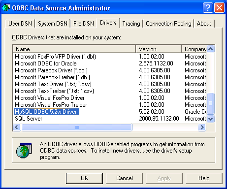
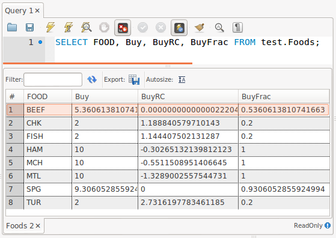

Connecting AMPL to MySQL
========================

In order to use MySQL with AMPL you need the MySQL ODBC driver, also known as
`Connector/ODBC <http://dev.mysql.com/doc/refman/5.1/en/connector-odbc.html>`__,
installed and have access to either local or remove database server.
You can download the latest version of the MySQL ODBC driver for various
platforms from `<http://dev.mysql.com/downloads/connector/odbc/>`__.

Installation
------------

GNU/Linux
~~~~~~~~~

Debian-based distributions
``````````````````````````

The following instructions apply to `Debian <http://www.debian.org/>`__
and Debian-based Linux distributions such as `Ubuntu
<http://www.ubuntu.com/>`__ and `Mint <http://linuxmint.com/>`__.

#. Install the MySQL ODBC driver:

   .. code-block:: bash

      $ sudo apt-get install libmyodbc

#. Register the driver:

   .. code-block:: bash

      $ sudo odbcinst -i -d -f /usr/share/libmyodbc/odbcinst.ini

Go to :ref:`usage`.

Other distributions
```````````````````

#. Install `unixODBC <http://www.unixodbc.org>`__ following `these instructions
   <http://www.unixodbc.org/download.html>`__.

#. Install the MySQL Connector/ODBC following `these instructions
   <http://dev.mysql.com/doc/refman/5.1/en/connector-odbc-installation.html#connector-odbc-installation-binary-unix>`__.

#. Register the ODBC driver. The easiest way to register the driver is
   by using the ``myodbc-installer`` utility included in the distribution,
   for example:

   .. code-block:: bash

      $ sudo myodbc-installer -d -a -n "MySQL" \
          -t "DRIVER=/usr/local/lib/libmyodbc5a.so"

   ``/usr/local/lib/libmyodbc5a.so`` is the path to the driver library
   that you installed in the previous step. You might need to change it
   if you have a different version of the driver or installed it in a
   different location. See the name of the ``.so`` file in the ``lib``
   directory of the installation package.

   Note that the MySQL ODBC/Connector distribution doesn't include the
   setup library so you have to omit the ``SETUP`` attribute during the
   driver registration unless you have installed this library from some
   other source.

Go to :ref:`usage`.

MacOS X
~~~~~~~

#. Install the MySQL Connector/ODBC as described `here
   <http://dev.mysql.com/doc/refman/5.1/en/connector-odbc-installation.html#connector-odbc-installation-binary-macosx>`__
   skipping the outdated last step (driver registration).

#. Register the driver:

   .. code-block:: bash

      $ sudo myodbc-installer -d -a -n "MySQL" \
          -t "DRIVER=/usr/local/lib/libmyodbc5a.so"

   ``/usr/local/lib/libmyodbc5a.so`` is the path to the driver library
   that you installed in the previous step. You might need to change it
   if you have a different version of the driver or installed it in a
   different location. See the name of the ``.so`` file in the ``lib``
   directory of the installation package.

   Note that the MySQL ODBC/Connector distribution doesn't include the
   setup library so you have to omit the ``SETUP`` attribute during the
   driver registration unless you have installed this library from some
   other source.

Go to :ref:`usage`.

Windows
~~~~~~~

Install and register the MySQL Connector/ODBC following `these instructions
<http://dev.mysql.com/doc/refman/5.1/en/connector-odbc-installation.html#connector-odbc-installation-binary-windows>`__.

.. _usage:

Usage
-----

We'll demonstrate usage of MySQL with AMPL on a small example.
For this example we use the diet problem which finds a combination of foods
that satisfies certain nutritional requirements. It is described in
`Chapter 2 of the AMPL book <http://www.ampl.com/BOOK/CHAPTERS/05-tut2.pdf>`__.

We assume that you've already installed the MySQL ODBC driver using
the instructions above and have access to the MySQL ``test`` database.

First download the data for the diet problem `diet-mysql.sql
<https://raw.github.com/vitaut/ampl/master/models/tables/diet-mysql.sql>`__
and import it to MySQL:

   .. code-block:: bash

      $ mysql test < diet-mysql.sql

Then download the model file `diet.mod
<https://raw.github.com/vitaut/ampl/master/models/tables/diet.mod>`__
and the script file `diet-mysql.run
<https://raw.github.com/vitaut/ampl/master/models/tables/diet-mysql.run>`__.

The script file first reads the model:

   .. code-block:: none

      model diet.mod;

Then it defines a parameter to hold a connection string. Since the connection
parameters are the same for all table declarations in our example this avoids
unnecessary duplication. In this case we specify all the connection parameters
explicitly, instead you can use a DSN file name or ``"DSN=<dsn-name>"`` as a
connection string.

   .. code-block:: none

      param ConnectionStr symbolic = "DRIVER=MySQL; DATABASE=test;";

The driver name is chosen automatically during installation on Windows,
so if you are using this OS or have chosen a driver name other than ``MySQL``
you'll have to specify it instead of ``MySQL`` in the connection string.
To find the driver name on Windows run ``odbcad32.exe``, ODBC Data Source
Administrator, go to the ``Drivers`` tab where all the installed drivers are
listed and find the one containing ``MySQL``:



A driver name containing a semicolon (``;``) should be surrounded with
``{`` and ``}`` in a connection string, for example:

   .. code-block:: none

      param ConnectionStr symbolic =
        "DRIVER={MySQL ODBC Driver; version 5.2}; DATABASE=test;";

Next there are several table declarations that use the ``ConnectionStr``
parameter defined previously:

   .. code-block:: none

      table dietFoods "ODBC" (ConnectionStr) "Foods":
         FOOD <- [FOOD], cost IN, f_min IN, f_max IN,
         Buy OUT, Buy.rc ~ BuyRC OUT, {j in FOOD} Buy[j]/f_max[j] ~ BuyFrac;

      table dietNutrs IN "ODBC" (ConnectionStr) "Nutrients": NUTR <- [NUTR], n_min, n_max;
      table dietAmts IN "ODBC" (ConnectionStr) "Amounts": [NUTR, FOOD], amt;

Finally the script reads the data from the tables

   .. code-block:: none

      read table dietFoods;
      read table dietNutrs;
      read table dietAmts;

solves the problem
                  
   .. code-block:: none

      solve;

and writes the solution back to the database:

   .. code-block:: none

      write table dietFoods;

Note that the same table ``dietFoods`` is used both for input and output.

Running the ``diet-mysql.run`` script with ampl shows that data connection
is working properly and the problem is easily solved:

   .. code-block:: bash

      $ ampl diet-mysql.run
      MINOS 5.51: optimal solution found.
      13 iterations, objective 118.0594032

You can use various database tools such as `MySQL workbench
<https://www.mysql.com/products/workbench/>`__ or `MySQL command-line tool
<http://dev.mysql.com/doc/refman/5.5/en/mysql.html>`__ to view the data
exported to the database from the AMPL script:



SQL statements
--------------

The default `identifier quote character in MySQL
<http://dev.mysql.com/doc/refman/5.0/en/identifiers.html>`__
is the backtick (`````). AMPL's ODBC table handler detects the quote
character automatically and uses it when necessary. However,
user-supplied SQL statements are passed to the MySQL ODBC driver as is
and should use the correct quotation. It is possible to enable support for
the ANSI standard quote character (``"``) in MySQL by setting the SQL mode to
`ANSI_QUOTES
<http://dev.mysql.com/doc/refman/5.1/en/server-sql-mode.html#sqlmode_ansi_quotes>`__.

Example:

   .. code-block:: none

      table Foods "ODBC" "DRIVER=MySQL; DATABASE=test;"
         "SQL=SELECT `FOOD`, `cost` FROM `Foods`;": [FOOD], cost;

Troubleshooting
---------------

This section lists frequent errors and possible solutions.

A connection problem is usually indicated by the following error:

.. code-block:: none

   Error reading table <table-name> with table handler odbc:
   Could not connect to <connection-string>.

The first thing to do if you get this error is to get additional information.
Add the option ``"verbose"`` to the table declaration that causes the error,
for example:

.. code-block:: none

   table dietFoods "ODBC" (ConnectionStr) "Foods" "verbose":
     ...

Then rerun your code and you should get a more detailed error
message such as

.. code-block:: none

   AMPL ODBC driver, version 20121108.
   SQLDriverConnect returned -1
   sqlstate = "IM002"
   errmsg = "[unixODBC][Driver Manager]Data source name not found, and no default driver specified"
   native_errno = 0

If the data source name (DSN) was not found as in the example above check 
if it is spelled correctly in the connection string. If you are not using a
DSN, check the driver name instead. On a Unix-based system you can get the
list of installed ODBC drivers using one of the following commands:

.. code-block:: none

   $ myodbc-installer -d -l

.. code-block:: none

   $ odbcinst -d -q

On Windows use the ODBC Data Source Administrator (see :ref:`usage`).

If the driver name contains a semicolon (``;``), check that the name is
surrounded with ``{`` and ``}`` in the connection string, for example:

   .. code-block:: none

      table Foods "ODBC" "DRIVER={MySQL ODBC Driver; version 5.2}; DATABASE=test;":
        ...
