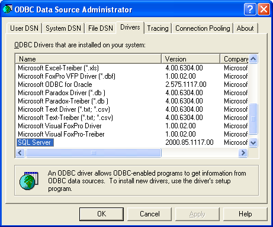
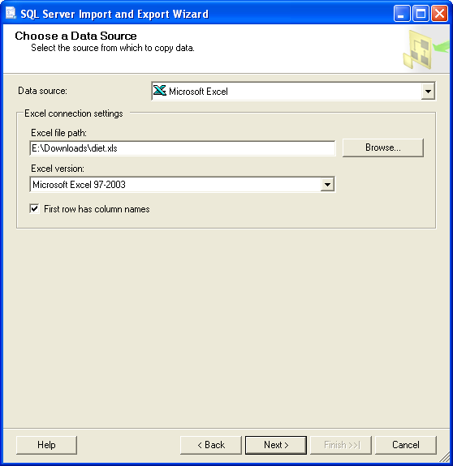
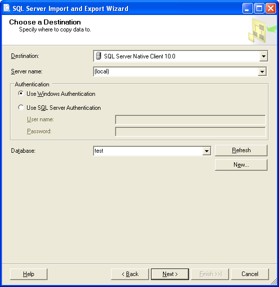
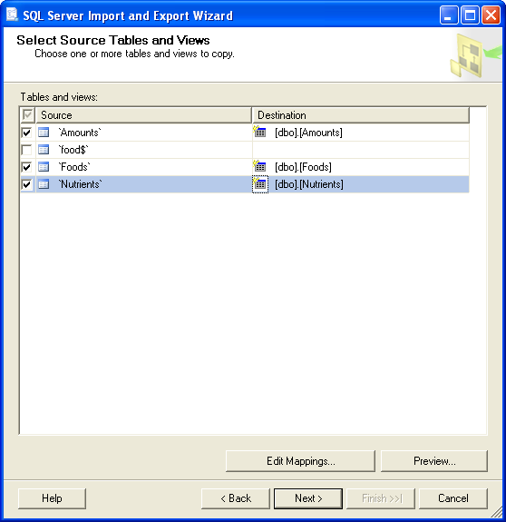
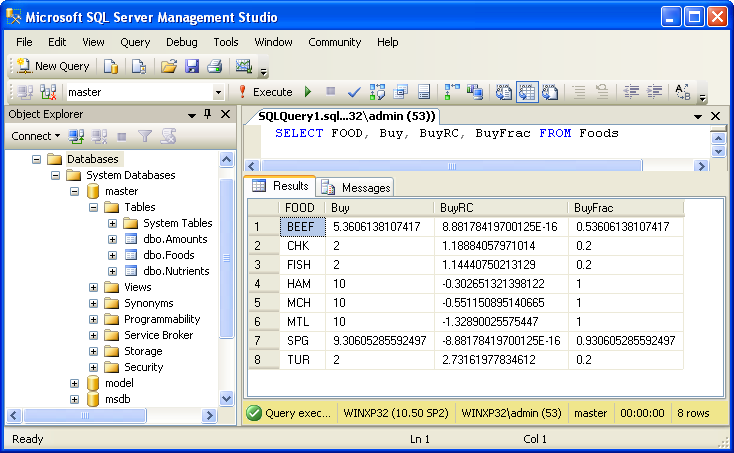

Connecting AMPL to SQL Server
=============================

To use Microsoft SQL Server with AMPL, you need to have the ODBC driver for SQL
Server installed and to have access to a database server, which could be either
local or remote.

Installation
------------

GNU/Linux
~~~~~~~~~

Follow the instructions in `Installing the Microsoft ODBC Driver for SQL Server on Linux
<http://msdn.microsoft.com/en-us/library/hh568454.aspx>`__.

Windows
~~~~~~~

The ODBC driver for MS SQL Server often comes installed by default on modern versions
of Windows. You can check if the driver is installed by running the ODBC Data Source
Administrator, ``odbcad32.exe``, and looking for SQL Server in the ``Drivers`` tab.

If the driver is missing, follow the instructions in
`Microsoft ODBC Driver for SQL Server: System Requirements, Installation, and Driver Files
<http://msdn.microsoft.com/en-us/library/jj730315.aspx>`__ to install it.

.. _usage:

Usage
-----

We'll demonstrate usage of MS SQL Server with AMPL on a small example.
For this example we use the diet problem, which finds a combination of foods
that satisfies certain nutritional requirements. It is described in
`Chapter 2 of the AMPL book <http://www.ampl.com/BOOK/CHAPTERS/05-tut2.pdf>`__.

We assume that you've already installed the MS SQL Server ODBC driver using
the instructions above and have access to an SQL Server database.

First download the data for the diet problem `diet.xls
<../models/tables/diet.xls>`__ and import it using the `SQL Server Import and
Export Wizard <http://msdn.microsoft.com/en-us/library/ms141209.aspx>`__
which can be run from the Start menu -> All Programs -> Microsoft SQL Server 
-> Import and Export Data. Skip the Welcome page, if any, by clicking Next,
then choose ``Microsoft Excel`` as a Data source and specify the path to
the downloaded ``diet.xls`` file in Excel file path:

Click Next and on the next page provide the connection settings for the
SQL Server database you are going to use:

Click Next, select ``Copy data from one or more tables or views`` on the next
page and click Next again.

Select tables ``Amounts``, ``Foods`` and ``Nutrients`` for import and click
Next:

Select ``Run immediately`` and click Finish on the next page and the one that
follows.

Once import is complete, download the model file `diet.mod
<../models/tables/diet.mod>`__ and the script file `diet-sqlserver.run
<../models/tables/diet-sqlserver.run>`__.

The script file first reads the model:

   .. code-block:: none

      model diet.mod;

Then it defines a parameter to hold a connection string. Since the connection
parameters are the same for all table declarations in our example, we
avoid unnecessary duplication. In this case we specify all the connection
parameters explicitly. Alternatively, you could use a DSN file name or
``"DSN=<dsn-name>"`` as a connection string.

   .. code-block:: none

      param ConnectionStr symbolic = "DRIVER={SQL Server}; SERVER=(local);";

If you are using Linux and have chosen a driver name other than ``SQL Server``,
you will have to specify this name instead of ``SQL Server`` in the
``DRIVER={SQL Server}`` attribute in the connection string.

You can use a different version of the ODBC driver for SQL Server on Windows
as well.  driver name is chosen automatically during installation on Windows,
so if you are using this OS, you will have to find the driver name and
specify it instead of ``SQL Server`` in the connection string.
To discover the driver name on Windows, run the ODBC Data Source
Administrator, ``odbcad32.exe``.  Go to the ``Drivers`` tab where all the
installed drivers are listed and look for the one containing ``SQL Server``:

A driver name containing a semicolon (``;``) should be surrounded with
``{`` and ``}`` in a connection string, for example:

   .. code-block:: none

      param ConnectionStr symbolic = "DRIVER={SQL Server; version 11.0};";

Next there are several table declarations that use the ``ConnectionStr``
parameter defined previously:

   .. code-block:: none

      table dietFoods "ODBC" (ConnectionStr) "Foods":
         FOOD <- [FOOD], cost IN, f_min IN, f_max IN,
         Buy OUT, Buy.rc ~ BuyRC OUT, {j in FOOD} Buy[j]/f_max[j] ~ BuyFrac;

      table dietNutrs IN "ODBC" (ConnectionStr) "Nutrients": NUTR <- [NUTR], n_min, n_max;
      table dietAmts IN "ODBC" (ConnectionStr) "Amounts": [NUTR, FOOD], amt;

Finally the script reads the data from the tables

   .. code-block:: none

      read table dietFoods;
      read table dietNutrs;
      read table dietAmts;

solves the problem
                  
   .. code-block:: none

      solve;

and writes the solution back to the database:

   .. code-block:: none

      write table dietFoods;

Note that the same table ``dietFoods`` is used both for input and output.

Running the ``diet-sqlserver.run`` script with ampl shows that data connection
is working properly and the problem is easily solved:

   .. code-block:: bash

      > ampl diet-sqlserver.run
      MINOS 5.51: optimal solution found.
      13 iterations, objective 118.0594032

You can use various database tools such as `SQL Server Management Studio
<http://msdn.microsoft.com/en-us/library/hh213248.aspx>`__ to view the data
exported to the database from the AMPL script:

SQL statements
--------------

The default `identifier quote character in SQL Server
<http://msdn.microsoft.com/en-us/library/ms174393.aspx>`__
is the double quotation mark (``"``). AMPL's ODBC table handler detects the
quote character automatically and uses it when necessary. However,
user-supplied SQL statements are passed to the ODBC driver for SQL Server
as is and should use the correct quotation.

Example:

   .. code-block:: none

      table Foods 'ODBC' 'DRIVER={SQL Server};'
         'SQL=SELECT "FOOD", "cost" FROM "Foods";': [FOOD], cost;

Troubleshooting
---------------

This section lists common problems with possible solutions.

The first thing to do in case of an error is to get additional information.
Add the option ``"verbose"`` to the table declaration that causes the error,
for example:

.. code-block:: none

   table dietFoods "ODBC" (ConnectionStr) "Foods" "verbose":
     ...

Then rerun your code and you should get a more detailed error message.
